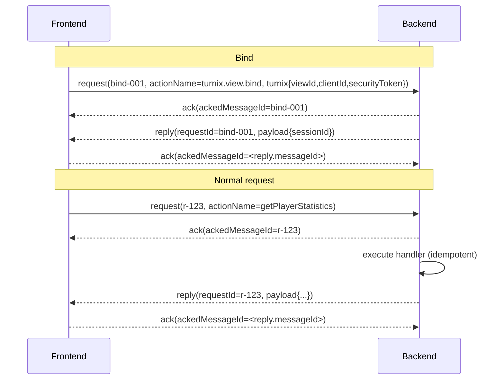

# Turnix: WebSocket Communication Between Frontend and Backend (Full CamelCase Names)

This document describes the Turnix WebSocket communication protocol used between the **JavaScript runtime (frontend)** and the **Python backend** with **camelCase names** for all fields, properties, and members.\
The protocol is **reliable**, **retry-aware**, and **designed for both application data and system operations** such as proxy calls and heartbeat checks.

This version standardizes names and unifies ACKs while keeping the base envelope Turnix‑agnostic and adding a Turnix extension for view/client binding.

---

## Overview

Each message is a single JSON **envelope** with two layers of concern:

- **Core (agnostic):** transport/reliability metadata + routing key
- **Payload (app):** application data

Supported kinds:

- `emit` (fire-and-forget, but receipt is ACKed)
- `request` / `reply`
- `ack` (unified acknowledgment type)
- `error` (failure reply)

Special operations are expressed via `actionName` (e.g., `heartbeat`, `proxy.call`).

**Heartbeat** is simply: `{ kind: "emit", actionName: "heartbeat" }`.

---

## Base Envelope

| Field Name | Type | Required | Description |
|------------|------|----------|-------------|
| **originSide** | `"frontend"` \| `"backend"` | ✅ | Who sent the message (for logging/debugging) |
| **kind** | `"emit"`, `"request"`, `"reply"`, `"ack"`, `"error"` | ✅ | Message kind |
| **messageId** | `string` | ✅ | Unique per message; **reused** on resend; increment `retryAttempts`. |
| **timestampUnixSeconds** | `number` (Unix seconds, float) | ✅ | Send time; used for latency/debug |
| **retryAttempts** | `number` | ✅ | 0 on first send, incremented on each resend |
| **actionName** | `string` | ✅ for `emit`/`request` | Logical operation name (routing key) |
| **payload** | `object` | ✅ (can be `{}`) | Application data. |

### Kind-specific fields

| kind | Additional required field(s) | Meaning |
|---|---|---|
| `reply` | **requestId: string** | The request being answered. |
| `error` | **requestId: string**, `payload.error` | Failure reply; `payload.error = { code, message, details? }`. |
| `ack` | **ackedMessageId: string** | Acknowledges receipt of the identified message. |

> **Why split names?** Using `requestId` (for replies/errors) and `ackedMessageId` (for ACKs) keeps logs and code self‑explanatory.

---

## Turnix Extension (view/client binding)

Keep the base envelope agnostic. When routing within Turnix, attach a **`turnix`** block:

```json
"turnix": {
  "viewId": "view:main",
  "clientId": "client:abc",
  "securityToken": "opaque-or-jwt"
}
```

- Send **at least once** per connection (handshake) so the backend can bind the socket.
- After a successful bind, the server associates the connection; you **don’t need** to repeat `turnix` on every message.
- On **rehydration/reconnect**, send a resume request including `turnix` and a prior **sessionId**.

### Handshake (bind)

**Request**
```json
{
  "originSide": "frontend",
  "kind": "request",
  "messageId": "bind-001",
  "timestampUnixSeconds": 1734469123.111,
  "retryAttempts": 0,
  "actionName": "turnix.view.bind",
  "payload": {},
  "turnix": { "viewId": "view:main", "clientId": "client:abc", "securityToken": "..." }
}
```

**Reply**
```json
{
  "originSide": "backend",
  "kind": "reply",
  "messageId": "bind-001-reply",
  "timestampUnixSeconds": 1734469123.222,
  "retryAttempts": 0,
  "actionName": "turnix.view.bind",
  "requestId": "bind-001",
  "payload": { "sessionId": "sess-7f93...", "bound": true }
}
```

### Resume (after reconnect)

**Request**
```json
{
  "originSide": "frontend",
  "kind": "request",
  "messageId": "resume-001",
  "timestampUnixSeconds": 1734469150.100,
  "retryAttempts": 0,
  "actionName": "turnix.view.resume",
  "payload": { "sessionId": "sess-7f93..." },
  "turnix": { "viewId": "view:main", "clientId": "client:abc", "securityToken": "..." }
}
```

## Example Messages

### Emit (heartbeat)
```json
{
  "originSide": "frontend",
  "kind": "emit",
  "messageId": "hb-1691234567890",
  "timestampUnixSeconds": 1733469123.111,
  "retryAttempts": 0,
  "actionName": "heartbeat",
  "payload": {}
}
```

### Request → ACK → Reply → ACK

**Request**
```json
{
  "originSide": "frontend",
  "kind": "request",
  "messageId": "r-123",
  "timestampUnixSeconds": 1733469124.123,
  "retryAttempts": 0,
  "actionName": "getPlayerStatistics",
  "payload": { "playerId": 42 }
}
```

**Receiver ACKs**
```json
{
  "originSide": "backend",
  "kind": "ack",
  "messageId": "a-1",
  "timestampUnixSeconds": 1733469124.150,
  "retryAttempts": 0,
  "ackedMessageId": "r-123",
  "payload": {}
}
```

**Reply**
```json
{
  "originSide": "backend",
  "kind": "reply",
  "messageId": "p-456",
  "timestampUnixSeconds": 1733469124.456,
  "retryAttempts": 0,
  "actionName": "getPlayerStatistics",
  "requestId": "r-123",
  "payload": { "playerHealth": 100, "playerScore": 4200 }
}
```

**Requester ACKs the reply**
```json
{
  "originSide": "frontend",
  "kind": "ack",
  "messageId": "a-2",
  "timestampUnixSeconds": 1733469124.600,
  "retryAttempts": 0,
  "ackedMessageId": "p-456",
  "payload": {}
}
```

### Error reply
```json
{
  "originSide": "backend",
  "kind": "error",
  "messageId": "e-789",
  "timestampUnixSeconds": 1733469124.500,
  "retryAttempts": 0,
  "actionName": "getPlayerStatistics",
  "requestId": "r-123",
  "payload": { "error": { "code": "E_VALIDATION", "message": "playerId missing", "details": {} } }
}
```

---

## Special Actions

### Proxy Call

Special `request` to act on backend-owned objects:

```json
{
  "originSide": "frontend",
  "messageKind": "request",
  "messageIdentifier": "proxyCall-001",
  "timestampUnixSeconds": 1733469123.222,
  "retryAttemptNumber": 0,
  "actionName": "proxy.call",
  "payload": {
    "objectIdentifier": "view:main",
    "methodName": "setSize",
    "methodArguments": [1920, 1080]
  }
}
```

---

## Receiver Behavior for Duplicates (request case)

Maintain TTL/LRU maps:

- `currentlyExecutingRequests: Map<requestId, {promise, startedAt, envelope}>`
- `completedReplies: Map<requestId, replyEnvelope>` (keep until the **reply** is ACKed)
- `seenMessageIds: LruSet` (drop duplicate inbound messages)
- `ackedIds: LruSet` (outbound ACK dedupe)

Algorithm:

1. On **request** arrival: always send `ack` (for `messageId`).
2. If `completedReplies.has(requestId)` → re-send the cached **reply/error**; do **not** re-run handler.
3. If `currentlyExecutingRequests.has(requestId)` → do nothing else; when the original completes, send its reply.
4. Otherwise → start handler, then send `reply` or `error`, cache it in `completedReplies` until its ACK is received.

---

## Canonical State Maps & Responsibilities

### Receiver-side (inbound):

- `currentlyExecutingRequests`: `Map<requestId, { promise, startedAt, envelope }>` — only requests that were ACKed and are still executing. No emits/replies/errors/acks here.
- `completedReplies`: `Map<requestId, replyEnvelope>` — cache reply/error until its ACK arrives, then evict.
- `seenMessageIds`: `LruTtlSet` — dedupe any inbound message id (drop duplicates; still re-ACK non-ack kinds).
- `ackedIds`: `LruTtlSet` — remember what we have already ACKed to suppress duplicate outbound ACKs.

### Sender-side (outbound):

- `awaitingReply`: `Map<requestId, { resolve, reject, timer, attempts }>` — pending promises for our outbound `request`s.
- `awaitingAck`: `Map<messageId, { env, timer, attempts }>` — outbound messages waiting for ACK (including requests, replies, emits if you require receipt).

---

## Send / Retry Rules

- Resend the **same `messageId`**; increment `retryAttempts`.
- **ACK timeout** → resend the original message with exponential backoff + jitter. Track attempts; surface failure on max.
- **Reply timeout** (on requester) → optionally resend the `request`; on max attempts, reject the waiting future/promise.
- Drop `completedReplies[requestId]` **only after** receiving an ACK for the **reply** (`ackedMessageId == reply.messageId`).

---

## Message Flow Sequence Diagram



---

## Handler Signatures (example)

### Python
```python
from __future__ import annotations
from typing import Any, Literal
from pydantic import BaseModel, Field, ConfigDict, model_validator

class Core(BaseModel):
    """Turnix-agnostic core. Frozen/immutable for handlers."""
    model_config = ConfigDict(frozen=True)

    originSide: Literal["frontend", "backend"]
    kind: Literal["emit", "request", "reply", "ack", "error"]
    messageId: str
    timestampUnixSeconds: float
    retryAttempts: int = Field(ge=0)

    # Routing key; required for emit/request
    actionName: str | None = None

    # Kind-specific fields
    requestId: str | None = None        # required for reply/error
    ackedMessageId: str | None = None   # required for ack

    @model_validator(mode="after")
    def _validate_by_kind(self) -> "Core":
        k = self.kind
        if k in ("emit", "request") and not self.actionName:
            raise ValueError("actionName is required for emit/request")
        if k in ("reply", "error") and not self.requestId:
            raise ValueError("requestId is required for reply/error")
        if k == "ack" and not self.ackedMessageId:
            raise ValueError("ackedMessageId is required for ack")
        return self

class TurnixCtx(BaseModel):
    viewId: str | None = None
    clientId: str | None = None
    securityToken: str | None = None

class WSMessage(BaseModel):
    core: Core
    payload: dict[str, Any] = Field(default_factory=dict)
    turnix: TurnixCtx | None = None  # optional Turnix extension

# --- Usage ---
# Parse from incoming JSON dict (no mutation of core allowed in handlers):
# msg = WSMessage.model_validate(raw_dict)
# print(msg.core.kind, msg.core.messageId)
#
# Serialize back to JSON-compatible dict:
# out = msg.model_dump()
```

### JavaScript
```js
function onMessage(msg) {
  const { originSide, kind, messageId, actionName, payload } = msg;
  // By convention, treat core as read-only; only modify payload
}
```

---

## Logging

```
[frontend.request] id=r-123 action=getPlayerStatistics retry=1
[backend.ack]     ackedMessageId=r-123
[backend.reply]   id=p-456 requestId=r-123 action=getPlayerStatistics
[frontend.ack]    ackedMessageId=p-456
```

## Implementation Checklist

---

- Single ACK type with `ackedMessageId`
- `reply`/`error` carry `requestId`
- `retryAttempts` increments on resend; `messageId` stays the same
- Caches with TTL/LRU: `currentlyExecutingRequests`, `completedReplies`, `ackedIds`, `seenMessageIds`
- Turnix extension block `turnix{viewId, clientId, securityToken}`
- Define `turnix.view.bind` + `turnix.view.resume`
- Drop cached reply only after its ACK
- Exponential backoff + jitter for resend timers

---

## Notes & Invariants

- Handlers for `request` must be **idempotent** or guarded by the dedupe caches.
- `emit` may be deduped if it has side effects; otherwise treat as at-least-once.
- Use TTLs/size limits on all caches to bound memory.
- Prefer monotonic timers for scheduling; `timestampUnixSeconds` is for logging.
